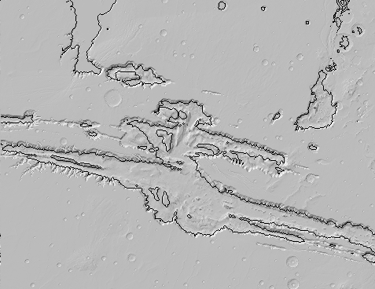

This is the closest image i could find of that section of the map. For some reason it is much darker and much cleaner
not to mention that it has more details.

This is the output image that we have. as you can see where the egm image had the elevation change at a certain level
a black conour line was added. It is hard to see becase of how faint it is and the shadows that were in the image to begin with.